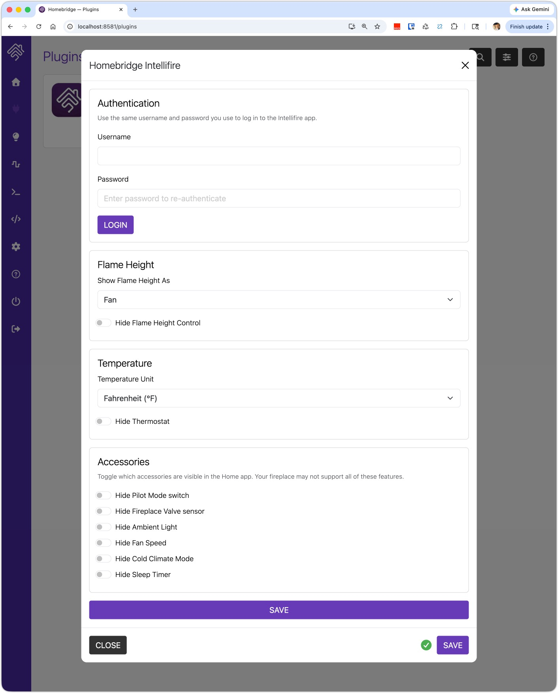

# homebridge-intellifire3

A Homebridge plugin for Intellifire (Hearth & Home) fireplaces. Connects via the Intellifire cloud API to expose your fireplace and its features as accessories in the Apple Home app.

This project is a fork, and significant update, of the (abandoned) [homebridge-intellifire2 project](https://github.com/davidashman/homebridge-intellifire2/pull/7).




## Installation

Install via the Homebridge UI, or manually:

```shell
npm install -g homebridge-intellifire3
```

## Configuration

Configure the plugin through the Homebridge UI, or add it manually to your `config.json`:

```json
{
  "platforms": [
    {
      "platform": "Intellifire",
      "name": "Intellifire",
      "username": "your@email.com",
      "password": "yourpassword",
      "flameHeightAs": "fan",
      "hidePilot": false,
      "hideSensor": false,
      "hideBlower": false,
      "hideLight": false,
      "hideFanSpeed": false,
      "hideThermostat": false,
      "hideColdClimate": false,
      "hideTimer": false
    }
  ]
}
```

### Configuration Options

| Option | Type | Default | Description |
|--------|------|---------|-------------|
| `username` | string | — | Your Intellifire account email |
| `password` | string | — | Your Intellifire account password |
| `temperatureUnit` | `"F"` \| `"C"` | `"F"` | Temperature unit used by your fireplace's API and shown in Home |
| `flameHeightAs` | `"fan"` \| `"dimmer"` | `"fan"` | Show flame height as a Fan or a Dimmer Light Switch in Home |
| `hidePilot` | boolean | `false` | Hide the Pilot Mode switch |
| `hideSensor` | boolean | `false` | Hide the Fireplace Valve contact sensor |
| `hideBlower` | boolean | `false` | Hide the Flame Height control |
| `hideLight` | boolean | `false` | Hide the Ambient Light control |
| `hideFanSpeed` | boolean | `false` | Hide the Fan Speed control |
| `hideThermostat` | boolean | `false` | Hide the Thermostat |
| `hideColdClimate` | boolean | `false` | Hide the Cold Climate Mode switch |
| `hideTimer` | boolean | `false` | Hide the Sleep Timer switch |

## Home App Accessories

Each fireplace is exposed as a single accessory with multiple services. You can hide any service you don't need via the config options above.

### Power
**Type:** Switch

Turns the fireplace on or off. Turning on Power automatically turns off Pilot Mode (they are mutually exclusive).

---

### Pilot Mode
**Type:** Switch  
**Config to hide:** `hidePilot: true`

Keeps the pilot light on without igniting the main flame. Turning on Pilot Mode automatically turns off Power.

---

### Fireplace Valve
**Type:** Contact Sensor  
**Config to hide:** `hideSensor: true`

Read-only. Shows open (detected) when the fireplace valve is active. Useful for automations that need to confirm the fireplace is actually burning.

---

### Flame Height
**Type:** Fan (default) or Dimmer Light Switch  
**Config to hide:** `hideBlower: true`  
**Config to change type:** `flameHeightAs: "fan"` or `"dimmer"`

Controls the height of the flame.

| Setting | Value |
|---------|-------|
| Off | 0 |
| Level 1 | 1 (Fan: speed 1/4 · Dimmer: 25%) |
| Level 2 | 2 (Fan: speed 2/4 · Dimmer: 50%) |
| Level 3 | 3 (Fan: speed 3/4 · Dimmer: 75%) |
| Level 4 | 4 (Fan: speed 4/4 · Dimmer: 100%) |

---

### Ambient Light
**Type:** Lightbulb (with brightness)  
**Config to hide:** `hideLight: true`

Controls the decorative ambient light on the fireplace unit.

| Setting | Value |
|---------|-------|
| Off | 0 |
| Low | 1 (~33%) |
| Medium | 2 (~67%) |
| High | 3 (100%) |

---

### Fan Speed
**Type:** Fan (with rotation speed)  
**Config to hide:** `hideFanSpeed: true`

Controls the blower fan speed. Only relevant if your unit has a powered blower.

| Setting | Value |
|---------|-------|
| Off | 0 |
| Levels 1–6 | 1–6 (mapped to 0–100%) |

---

### Thermostat
**Type:** Thermostat  
**Config to hide:** `hideThermostat: true`

Exposes the fireplace thermostat as a HomeKit Thermostat accessory.

- **Current Temperature** — read-only sensor value from the fireplace, displayed in °F
- **Target Temperature** — sets the thermostat setpoint, displayed in °F (range: 60–90 °F)
- **Heating Mode** — Heat turns the fireplace on; Off turns it off (synced with the Power switch)

The `temperatureUnit` config option controls how the Home app displays temperatures. The Intellifire API always uses Celsius internally — `temperatureUnit` only affects the display unit shown in the Home app tile.

Useful for automations like "if room temperature drops below 65°F, turn on the fireplace."

---

### Cold Climate Mode
**Type:** Switch  
**Config to hide:** `hideColdClimate: true`

Enables cold climate mode on the fireplace. Refer to your fireplace manual for details on what this mode does for your specific unit.

---

### Sleep Timer
**Type:** Switch  
**Config to hide:** `hideTimer: true`

Activates the fireplace's built-in sleep timer. When enabled, the fireplace will shut off automatically after its configured timer duration.

---

## Notes

- Not all features are available on all Intellifire fireplace models. If a field is not returned by your unit's API, the accessory will show its default/last-known state.
- The thermostat temperature range and units depend on your fireplace model. Values are passed through as-is from the API (assumed Celsius).
- The Power switch and Thermostat heating mode are kept in sync — changing one updates the other in the Home app.
